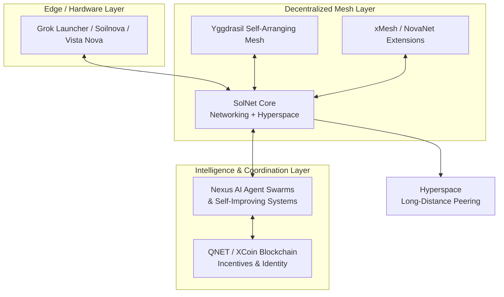

# SolNet

[](https://opensource.org/licenses/MIT)
[](https://www.python.org/)
[](https://github.com/digitaldesignerjazz/solnet)

**SolNet** — Decentralized SolNet networking and hyperspace integration layer for Nexus AI agent swarms, long-distance Yggdrasil mesh coordination, and NovaNet/xMesh/QNET ecosystem.

Part of the broader **Esslinger & Co.** vision for self-improving, privacy-focused global decentralized infrastructure.

---

## Vision & Strategic Context

SolNet serves as the critical **networking and hyperspace glue** within the Esslinger & Co. technology stack. It bridges:

- **Physical & Edge Layer**: Hardware prototypes (Grok Launcher, Soilnova environmental systems, Vista Nova / York Autotype visualization & interaction devices)
- **Mesh Connectivity Layer**: Yggdrasil self-arranging mesh VPNs, xMesh/NovaNet long-range extensions, QNET protocols
- **Intelligence & Coordination Layer**: Nexus central hub for AI agent swarms (including emotional swarm intelligence from Circuit 1.0 and Lyra OS concepts), self-improving agent collectives, and blockchain-anchored coordination via XCoin/QCoin

This enables resilient, privacy-preserving, globally scalable infrastructure where AI agents can coordinate across continents via hyperspace-enhanced mesh links, hardware sensors feed real-time data into self-optimizing swarms, and decentralized identity/incentives emerge from QNET.

Aligned with core principles: family tradition of innovation (Esslinger Corporation), privacy (Tor/I2P integration points), self-improving networks, and immersive multi-agent systems.

## Key Features

- **Yggdrasil & Mesh-Native Integration**: Deep integration with Yggdrasil for automatic peer discovery, resilient routing, and extensions for long-distance / hyperspace peering beyond standard mesh limits.
- **Hyperspace Peering & Coordination**: Custom protocol layer for low-latency, high-resilience tunnels between distant mesh segments and Nexus AI swarms. Supports session multiplexing for multiple agent conversations.
- **AI Agent Swarm Orchestration**: First-class support for Nexus swarms — agent discovery, trust establishment, emotional state propagation (loyalty/friendship models), and collective decision-making across the decentralized fabric.
- **Privacy & Security by Design**: End-to-end encryption (NaCl/crypto primitives), optional anonymity overlays (Tor/I2P egress), metadata minimization, and zero-trust agent communication.
- **Blockchain & Incentive Layer Hooks**: Pluggable adapters for QNET/XCoin — decentralized identity (DIDs), resource marketplaces for bandwidth/compute, oracle integration for hardware sensor data (Soilnova).
- **Self-Improving Infrastructure**: Foundations for adaptive routing algorithms, traffic pattern learning, predictive mesh healing, and distributed feedback loops that improve over time without central authority.
- **Multi-Prototype Synergy**: Explicit design for interplay with Grok Launcher (compute/edge nodes), Soilnova (sensor data ingestion), Vista Nova (real-time network topology visualization and autotype interfaces).
- **Developer Experience**: Clean Python SDK for rapid integration with AI/agent codebases; planned high-performance Rust core daemon for production mesh nodes; Docker-first deployment.

## Architecture Overview

See detailed documentation in [`docs/architecture.md`](docs/architecture.md). High-level conceptual flow:



SolNet acts as the **integration fabric** enabling seamless data, command, and coordination flow between hardware reality, robust mesh connectivity, and intelligent autonomous agents.

## Quick Start (Python SDK)

### Prerequisites
- Python ≥ 3.10
- Running Yggdrasil node (https://yggdrasil-network.github.io/)
- Git (for editable install)

### Installation

```bash
# From source (recommended for development)
git clone https://github.com/digitaldesignerjazz/solnet.git
cd solnet
pip install -e .

# Or directly
pip install git+https://github.com/digitaldesignerjazz/solnet.git
```

### Basic Usage Example

```python
from solnet import SolNetNode
import asyncio

async def main():
    node = SolNetNode(
        node_id="esslinger-node-01",
        yggdrasil_endpoint="http://localhost:9001"  # or your Yggdrasil admin socket
    )
    
    # Join/participate in the local mesh
    await node.join_mesh(peers=["peer1.ygg", "peer2.ygg"])
    
    # Establish hyperspace link to remote swarm segment
    tunnel = await node.establish_hyperspace_link(
        target="nexus-swarm-alpha.example.ygg",
        swarm_context="emotional-intelligence-collective"
    )
    
    # Coordinate with Nexus AI agents
    result = await node.coordinate_swarm(
        tunnel=tunnel,
        agents=["agent-lyra", "agent-circuit"],
        payload={"intent": "optimize_global_routing", "priority": "high"}
    )
    
    print("Swarm coordination result:", result)

if __name__ == "__main__":
    asyncio.run(main())
```

See `examples/basic_integration.py` for a more complete runnable example.

## Related Projects in the Esslinger & Co. Ecosystem

- [Nexus](https://github.com/digitaldesignerjazz/nexus) — Central integration hub for xMesh/NovaNet/QNET, AI swarms, hardware prototypes
- [Nexus Hyperspace](https://github.com/digitaldesignerjazz/nexus-hyperspace) — Advanced hyperspace peering & long-distance Yggdrasil coordination
- [XNet Mesh](https://github.com/digitaldesignerjazz/xnet-mesh) — Rust implementation for Nova Prototype / QNET / xMesh
- [Circuit 1.0](https://github.com/digitaldesignerjazz/circuit-1.0) — Emotional swarm intelligence with loyalty & friendship dynamics
- [Lyra OS](https://github.com/digitaldesignerjazz/lyra-os) — Emotional swarm-based operating system
- Esslinger & Co. corporate & prototype repositories

## Development Status & Roadmap

Early development phase. Core abstractions and Python integration layer are being established. See [`docs/roadmap.md`](docs/roadmap.md) for phased plan including Rust core, full hyperspace protocol, QNET incentives, hardware integrations (Soilnova sensor feeds, Vista Nova visualization), and self-improving feedback mechanisms.

## Contributing

Contributions are welcome and encouraged! Focus areas:
- Mesh protocol extensions and Yggdrasil integrations
- AI swarm coordination logic and emotional models
- Privacy enhancements (Tor/I2P, advanced crypto)
- Hardware prototype bridges (Grok Launcher, Soilnova, Vista Nova)
- Documentation, tests, and examples

Please read [`docs/contributing.md`](docs/contributing.md) and open issues or pull requests.

## License

This project is licensed under the MIT License — see the [LICENSE](LICENSE) file for details.

Copyright © 2026 Sven Normen Esslinger / Esslinger & Co. All rights reserved in accordance with the license terms.

---

*Building the decentralized, self-improving nervous system for tomorrow's autonomous infrastructure.*
